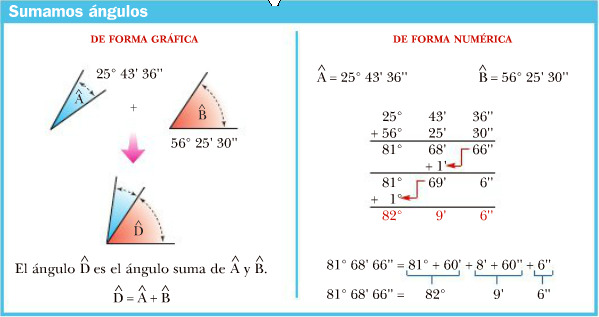

### Sumador de ángulos

Se desea un programa que dados 2 ángulos expresados en grados minutos y segundos, informe la suma de ambos en grados minutos y segundos.

A modo de ejemplo se agrega la siguiente gráfica:

> Tener en cuenta que en el algoritmo implementado no necesariamente hay que seguir el mecanismo empírico propuesto por la imagen.

RESPUESTA [AQUI](https://github.com/natimmansilla/GuiaEjerciciosProgramacion-AED/blob/30953fd4c0ecf1bd7f995d7312c08becaf1c07ef/Guia%2003/G03-Ej14-a.py)

RESPUESTA [AQUI] CON VARIABLES (https://github.com/natimmansilla/GuiaEjerciciosProgramacion-AED/blob/30953fd4c0ecf1bd7f995d7312c08becaf1c07ef/Guia%2003/G03-Ej14-a.py)

RESPUESTA [AQUI] CON TUPLAS (https://github.com/natimmansilla/GuiaEjerciciosProgramacion-AED/blob/30953fd4c0ecf1bd7f995d7312c08becaf1c07ef/Guia%2003/G03-Ej14-b.py)

RESPUESTA [AQUI] CON TUPLAS2 (https://github.com/natimmansilla/GuiaEjerciciosProgramacion-AED/blob/30953fd4c0ecf1bd7f995d7312c08becaf1c07ef/Guia%2003/G03-Ej14-c.py)
