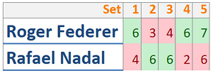

### Partido de Tenis

**Introducción**

Piense en los resultados de los partidos de tenis, donde se disputan 3 o 5 Sets.

Cada set se juega hasta que uno de los jugadores gana 6 games, teniendo una diferencia mínima de dos games sobre el otro jugador. En la figura, se puede ver que Roger Federer ganó 6 games contra 4 que ganó Rafael Nadal, permitiéndole ganar el primer set.

Como puede ocurrir que, en un set, se dé un resultado parcial 6-6, y para ganar un set hace falta diferencia de 2 games, existe un desempate denominado tie-break, lo que permite un resultado de 7-6, como en el último set del ejemplo. También es válido, el resultado 7-5, que le permite a un jugador obtener ventaja de 2 sets que necesita, a pesar de haber ganado ya 6 games

El partido completo lo gana el jugador que ganó la mayor cantidad de sets, en un partido a 3 sets, el jugador que gane 2 vencerá, en un partido a 5 sets, como el del ejemplo, el que logre 3 sets (Roger Federer, en nuestro caso). Pero claro, si un jugador hubiese ganado la mayoría antes del total de los sets (si, por ejemplo Federer hubiese ganado los 3 primeros), ya no se jugarían los restantes sets, porque un jugador ya habría ganado.

**Se Pide**

Teniendo en cuenta solamente lo expuesto, se solicita un programa que permita:

1. Que el usuario ingrese por teclado la cantidad de sets (3 o 5) e ingrese el resultado de un partido finalizado (una tabla como la del ejemplo)
2. Validar que los resultados cargados sean válidos de acuerdo a lo expuesto previamente, por ejemplo:
    - Que no haya sets con cantidad de games incorrectos (8 a 6, 1 a 1, etc.)
    - Que todos los games hayan sido ganados por diferencia de 2 o más, exceptuando las situaciones tie-break
    - Que no se hayan jugado sets de más (ej: que un jugador haya ganado los 3 primeros sets de un partido de 5 y que se hayan jugado los sets restantes)
    - Otras validaciones que se desprendan de la descripción
3. Determinar quién ganó (y en qué set lo hizo)
4. Informar la cantidad de sets ganados por tie-break
5. Mostrar un array que contenga la diferencia de resultado para cada set (en el ejemplo, el primer set terminó con una diferencia de 2 games)
6. Mostrar los sets ordenados de acuerdo a la diferencia entre jugadores (de mayor a menor)