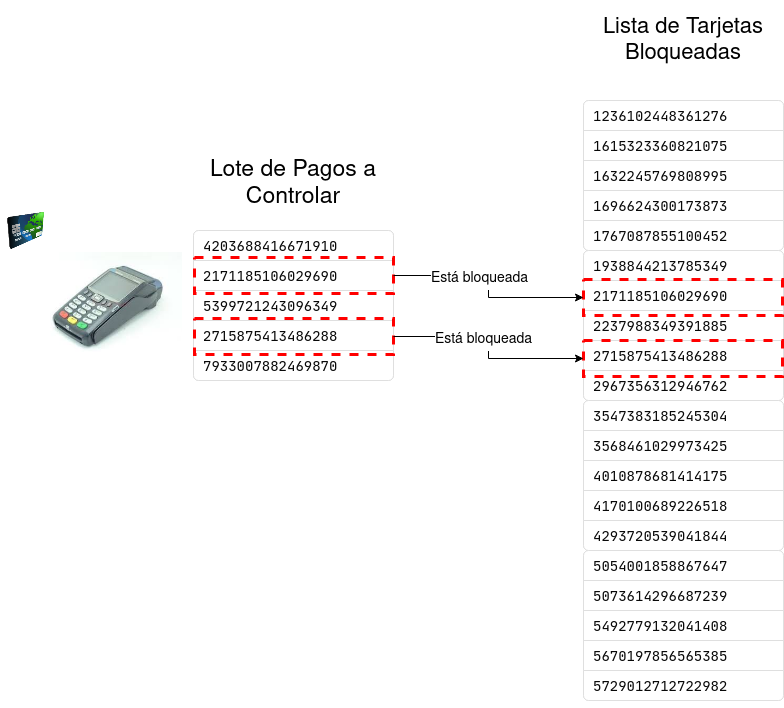

### Procesamiento de Tarjetas

La empresa Esfera S.A. (nuestro cliente) se dedica al procesamiento de transacciones de tarjetas de crédito de distintas "marcas”. Los  pagos se realizan un equipo del comercio y éstas son informadas (enviadas), en el mismo momento, al sistema de autorizaciones de nuestro cliente donde se decide si el pago se puede hacer o no. Para nuestro ejemplo, esto significa que únicamente se envía el número de tarjeta.

Existen casos excepcionales (algunos vuelos, transporte marítimo, etc.) donde estos pagos no pueden ser enviados en el mismo momento en el que se generan (compré unas papas fritas en un avión y el equipo donde presenté la tarjeta no tiene conexión con el sistema de autorizaciones). Ante estos casos Esfera S.A. acepta que, en algún momento del día, se descargue el listado de los pagos realizados en un equipo particular (por ejemplo, el equipo del avión donde compré las papas fritas) y se carguen todas juntas en su sistema central. Esta lista contiene únicamente el número de tarjeta que realizó el pago.

Pero hay una complicación adicional: al no envierse estos pagos en el mismo momento en el que el usuario presentó la tarjeta, podría haberse realizado un pago con una tarjeta que estaba bloqueada (por ejemplo, se informó el robo de la misma, o se trataba de alguna falsificación sofisticada, etc.). Por este motivo, el sistema de autorizaciones, mantiene una lista ordenada a la que vamos a llamar “Lista de Tarjetas Inválidas” donde tiene el número de cada tarjeta que no es válida, en un momento dado, para realizar pagos. Esta lista se actualiza una única vez al día y se utiliza para controlar todas las transacciones realizadas. Si un pago se realizó con una tarjeta que está en esta lista, ese pago se rechaza.

Esquema de Auatorización

Como detalle adicional, el primer dígito del número de tarjeta (que no puede ser cero) indica su “marca”.
A saber: (1=Vasa, 2=American Slow, 3=MaterCard, 4=Tarjeta Pomelo, 5=Launcher’s Club, 6=JNoCB, 7=AsiaPay, 8=Undiscovered Card, 9=AED Card).

Por ejemplo, la tarjeta cuyo número es: 9987015911049952, corresponde a una "AED Card"

Nuestro cliente nos pide desarrollar el sistema de autorizaciones, para los pagos que no pudieron ser informados en el momento de compra. Para eso se debe desarrollar un programa Python que permita:

1. Cargar por única vez, al inicio del programa, la Lista de Tarjetas Inválidas
2. Cargar lotes de transacciones para su procesamiento. Recordar que estos lotes de transacciones son, simplemente, listas de números de tarjetas que realizaron pagos en un equipo.
3. Informar cuántos pagos fueron rechazados, pero discriminados por “marca” de la tarjeta. (Cuántos pagos se rechazaron con Vasa, cuántos con American Slow, etc.) y cuál es la marca de tarjeta con mayores pagos rechazados 
